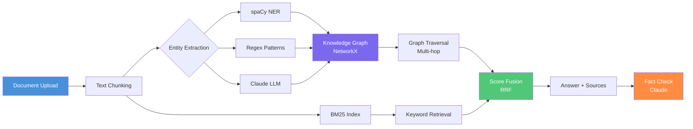

[](https://github.com/ChunkyTortoise/graphrag-demo/actions)
[](https://github.com/ChunkyTortoise/graphrag-demo/actions)
[](https://github.com/ChunkyTortoise/graphrag-demo/actions)
[](LICENSE)


# GraphRAG Demo: Entity-Aware Multi-Hop Retrieval

A production-grade RAG pipeline enhanced with knowledge graph extraction for multi-hop reasoning, entity-aware retrieval, and confidence scoring.

## Try It Now

Run locally — no API key required for BM25 keyword retrieval mode:

```bash
git clone https://github.com/ChunkyTortoise/graphrag-demo.git
cd graphrag-demo
pip install -e "."
streamlit run app.py
```

> To enable Claude-powered entity extraction: add your `ANTHROPIC_API_KEY` in the app sidebar.
> BM25 retrieval works without any API key using fast keyword-based graph construction.

### What to Try

1. Upload any `.txt` or `.pdf` document (try a Wikipedia article or a news story)
2. Ask a multi-hop question: *"How are [Entity A] and [Entity B] related?"*
3. Toggle between BM25-only and Claude extraction in the sidebar
4. Inspect the knowledge graph visualization — nodes are entities, edges are relationships

## What Makes It Different From Basic RAG

- **Entity Graph** — Extracts named entities (people, orgs, locations, products, concepts) and builds a NetworkX knowledge graph with co-occurrence relationships
- **Multi-Hop Retrieval** — Traverses the entity graph to find related chunks beyond keyword matching, enabling answers that connect information across document sections
- **Confidence Scores** — Quantifies answer reliability based on entity coverage and retrieval quality
- **Fact Checking** — Validates answer claims against source text with word-level overlap analysis
- **Side-by-Side Comparison** — Compare Basic RAG (BM25-only) vs GraphRAG on the same query

## Architecture



## Run Locally

```bash
# Clone
git clone https://github.com/ChunkyTortoise/graphrag-demo.git
cd graphrag-demo

# Install
pip install -e ".[dev]"

# Optional: better entity extraction
pip install -e ".[nlp]"
python -m spacy download en_core_web_sm

# Optional: Claude-powered extraction + answer generation
export ANTHROPIC_API_KEY=sk-ant-...

# Run tests
pytest tests/ -x -q

# Launch
streamlit run app.py
```

## Streamlit Cloud Deployment

1. Push to GitHub
2. Go to [share.streamlit.io](https://share.streamlit.io)
3. Connect your repo, set `app.py` as the main file
4. Optionally add `ANTHROPIC_API_KEY` in Secrets for LLM-powered features
5. Deploy

## Project Structure

```
graphrag-demo/
├── graph/
│   ├── extractor.py       # Entity + relationship extraction
│   ├── knowledge_graph.py # NetworkX graph builder + serialization
│   └── retriever.py       # Graph-aware multi-hop retrieval
├── rag/
│   ├── basic.py           # Standard BM25 RAG pipeline
│   └── graph_rag.py       # GraphRAG pipeline with fact checking
├── tests/
│   ├── test_extractor.py
│   ├── test_knowledge_graph.py
│   └── test_retriever.py
├── app.py                 # Streamlit app (3 tabs: Chat, Graph, Comparison)
├── pyproject.toml
└── requirements.txt
```

## Certifications Applied

Domain pillars from [19 completed AI/ML certifications](https://caymanroden.com) backing this project:

| Domain | Certification | Applied In |
|--------|--------------|-----------|
| Knowledge Graphs & NLP | DeepLearning.AI NLP Specialization | Entity extraction pipeline, relationship mapping, graph traversal |
| Retrieval Systems | IBM AI Engineering Professional Certificate | BM25 index, score fusion (RRF), multi-hop retrieval |
| LLM Integration | Anthropic Building with Claude (Vanderbilt) | Claude entity extraction, fact-checking layer |
| Data Engineering | IBM Data Engineering | Document chunking, graph persistence, corpus indexing |
| Visualization | Meta Back-End Developer | Streamlit graph visualization, interactive UI |

## Built By

**Cayman Roden** — AI/ML Engineer
[LinkedIn](https://www.linkedin.com/in/caymanroden/) | [GitHub](https://github.com/ChunkyTortoise) | [Fiverr](https://www.fiverr.com/caymanroden)

## License

[MIT](LICENSE)
