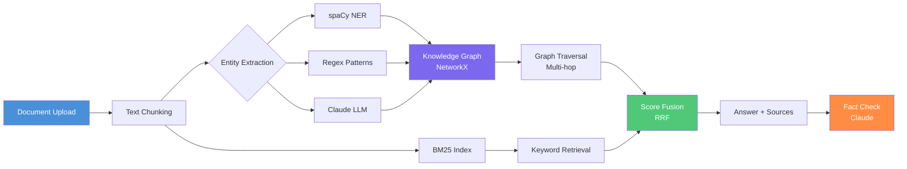

# Spec: graphrag-demo — Portfolio Polish

**File**: `~/Projects/graphrag-demo/docs/specs/2026-03-19-feature-graphrag-demo-portfolio-polish-spec.md`
**Date**: 2026-03-19
**Effort**: ~2-3h | **Risk**: Low (text + CI config only)
**Repo**: `~/Projects/graphrag-demo/` → `ChunkyTortoise/graphrag-demo`
**Stack**: NetworkX/spaCy/Streamlit/Anthropic
**Tests**: 63 passing | **Live**: Streamlit Cloud (LIVE — no auth required for BM25 mode)

---

## Context

LIVE on Streamlit Cloud. Visually impressive knowledge graph UI. GraphRAG is trending (Microsoft's GraphRAG paper drove broad interest). The current README references 2 screenshots that don't exist in `docs/screenshots/` — broken image links on GitHub. Defer screenshot capture to a browser automation session; instead add HTML comments.

### Key Findings

- `docs/` directory exists (has `screenshots/` subdirectory) — create `docs/specs/` (this file triggers creation)
- `docs/screenshots/` is EMPTY — README references 2 images that return 404 on GitHub
- CI installs `pytest-cov` (it's in `requirements.txt`) but doesn't pass `--cov` flags to pytest
- No coverage badge or test badge in README
- README has ASCII art architecture — replace with mermaid
- No "Try It Now" section pointing to the live Streamlit URL
- No Certifications Applied section

---

## Requirements

| REQ | Description | Effort |
|-----|-------------|--------|
| F01 | Mermaid architecture diagram | 30m |
| F02 | Add coverage to CI | 10m |
| F03 | Coverage badge | 5m |
| F04 | "Try It Now" section | 15m |
| F05 | Certifications Applied | 30m |
| F06 | Test count badge | 10m |
| F07 | Note broken screenshots | 5m |

---

## F01 — Mermaid Architecture Diagram

Replace the existing ASCII art architecture section with a mermaid diagram. Find the ASCII art block (typically under a heading like `## Architecture` or `## How It Works`) and replace it.

```markdown
## Architecture


```

If no architecture section exists, add it between the feature list and the "Getting Started" / "Usage" section.

---

## F02 — Add Coverage to CI

**File**: `.github/workflows/ci.yml`

Find the pytest command. It currently runs without `--cov`. Add coverage flags:

**Before** (find the actual line):
```yaml
run: pytest tests/ -v
```

**After**:
```yaml
run: pytest tests/ -v --cov=graphrag --cov-report=term-missing --cov-fail-under=70
```

Note: `pytest-cov` is already in `requirements.txt` so no additional dependency install needed.

The module name to cover is `graphrag` — verify this matches the actual package directory name by checking `ls ~/Projects/graphrag-demo/graphrag/` or `ls ~/Projects/graphrag-demo/src/`. If the package name differs, use the correct name.

---

## F03 — Coverage Badge

Add a static coverage badge to the badge row at the top of README. Place after the existing test/CI badge(s):

```markdown
[](https://github.com/ChunkyTortoise/graphrag-demo/actions)
```

This static badge states "≥70%" which CI now enforces via `--cov-fail-under=70`.

---

## F04 — "Try It Now" Section

Insert near the top of the README, right after the description/intro paragraph and badges. Should be the first actionable section a visitor sees.

```markdown
## Try It Now

The app is live — no API key required for BM25 keyword retrieval mode.

**[Launch GraphRAG Demo on Streamlit Cloud →](https://graphrag-demo.streamlit.app)**

> To enable Claude-powered entity extraction: add your `ANTHROPIC_API_KEY` in the app sidebar.
> BM25 retrieval works without any API key using fast keyword-based graph construction.

### What to Try

1. Upload any `.txt` or `.pdf` document (try a Wikipedia article or a news story)
2. Ask a multi-hop question: *"How are [Entity A] and [Entity B] related?"*
3. Toggle between BM25-only and Claude extraction in the sidebar
4. Inspect the knowledge graph visualization — nodes are entities, edges are relationships
```

Note: Verify the exact Streamlit Cloud URL before inserting. Check the repo's existing README or `streamlit_app.py` for the correct deployed URL. If URL is unclear, use a placeholder comment: `<!-- TODO: verify Streamlit Cloud URL -->`.

---

## F05 — Certifications Applied

Add before the `## License` section:

```markdown
## Certifications Applied

Domain pillars from [19 completed AI/ML certifications](https://caymanroden.com) backing this project:

| Domain | Certification | Applied In |
|--------|--------------|-----------|
| Knowledge Graphs & NLP | DeepLearning.AI NLP Specialization | Entity extraction pipeline, relationship mapping, graph traversal |
| Retrieval Systems | IBM AI Engineering Professional Certificate | BM25 index, score fusion (RRF), multi-hop retrieval |
| LLM Integration | Anthropic Building with Claude (Vanderbilt) | Claude entity extraction, fact-checking layer |
| Data Engineering | IBM Data Engineering | Document chunking, graph persistence, corpus indexing |
| Visualization | Meta Back-End Developer | Streamlit graph visualization, interactive UI |
```

---

## F06 — Test Count Badge

Add a static test count badge to the badge row:

```markdown
[](https://github.com/ChunkyTortoise/graphrag-demo/actions)
```

**Before inserting**, run pytest to verify the count is still 63:

```bash
cd ~/Projects/graphrag-demo
pytest tests/ -q --tb=no 2>&1 | tail -3
```

If the count differs, update the badge number to match.

---

## F07 — Note Broken Screenshots

**Do NOT delete** the existing screenshot references in README. Instead, add an HTML comment directly above the broken image block:

Find the screenshot section (looks something like):
```markdown


```

Replace with:
```markdown
<!-- Screenshots pending browser automation capture — images not yet in docs/screenshots/ -->


```

This preserves the intent and file paths for when the screenshots are captured, while preventing confusion about why they show as broken on GitHub.

---

## Verification

```bash
cd ~/Projects/graphrag-demo

# Detect package name (verify before running CI step)
ls -la | grep -E "^d" | awk '{print $NF}'

# Tests pass with coverage floor
pytest tests/ -q --tb=short --cov=graphrag --cov-fail-under=70

# README has key sections
grep -l "mermaid\|## Try It Now\|## Certifications Applied\|coverage" README.md && echo "README sections: OK"

# Broken screenshot comment present
grep -n "Screenshots pending" README.md && echo "Screenshot comment: OK"

# Coverage badge present
grep -n "coverage" README.md | grep "img.shields.io" && echo "Coverage badge: OK"

# Test count badge present
grep -n "63" README.md | grep "img.shields.io" && echo "Test badge: OK"
```

All checks must pass before committing.

---

## Commit Message

```
docs: portfolio polish — mermaid diagram, coverage CI, badges, Try It Now

- Replace ASCII art with mermaid architecture diagram
- Add --cov=graphrag --cov-fail-under=70 to CI pytest command
- Add static coverage (≥70%) and test count (63 passing) badges
- Add "Try It Now" section linking to live Streamlit Cloud app
- Add Certifications Applied section
- Add HTML comment above broken screenshot references
```

---

## Deferred

| Item | Why Deferred |
|------|-------------|
| Screenshot capture | Browser automation session needed (Streamlit Cloud + chrome extension) |
| Test expansion beyond 63 | 63 is adequate for a demo repo — low priority |
| mkdocs / API docs | Overkill for a demo project |
